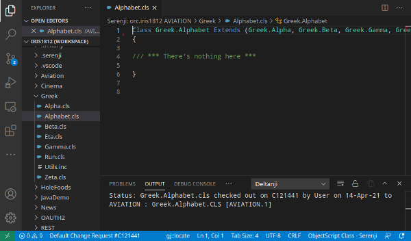
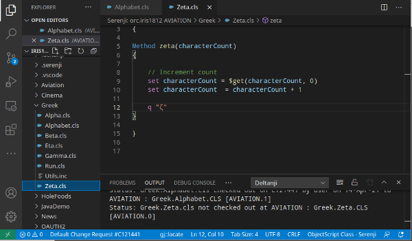
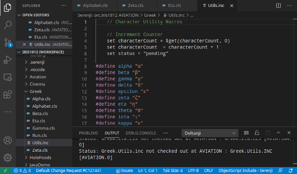
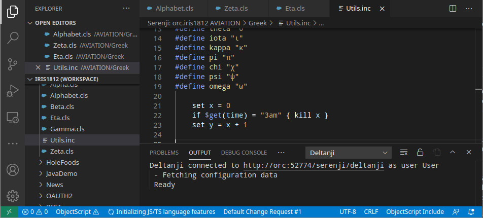

# gj :: locate

Use gj :: locate to get to the source of your errors.

Using VS Code with either the Serenji extension or the basic InterSystems objectscript extension, click on the gj::locate caption in the status bar, enter an objectscript error message or a line reference from an .int routine.  gj::locate will take you the corresponding line in your source code.

## Features

### Debugging 101
The first step in debugging any error is to make sure you are looking at the correct line of code.  Error messages give the error location in the compiled .int code, not in your source code.  There are many special rules about how lines of source code map to corresponding line in the compiled .int routines and you probably don't know them all.  Locating the correct source line for an error is an essential step in debugging a problem.

Simply copy and paste any InterSystems IRIS error message into gj::locate and it will take you directly to the corresponding source line.

### But Wait! There's more

You can use gj::locate to open any class or routine and go straight to the line you want.  For example you can enter alpha^Greek.Alphabet to go to the alpha method in Greek.Alphabet.cls.

You can specify a location using any of these formats to get quickly and directly to where you want to be:
 * Package.Class
 * Package.Class.cls
 * ^Package.Class
 * method^Package.Class
 * method+offset^Package.Class
 * method (in currently opened class)
 * method+offset (in currently opened class)
 * routine.mac
 * routine.inc
 * routine.int
 * ^routine
 * label^routine
 * label+offset^routine
 * +offset^routine
 * label (in currently opened routine)
 * label+offset (in currently opened routine)
 * +offset (in currently opened routine)

### And one more thing...  

You can install the gjLocate userscript in your browser (you'll need the Tampermonkey browser extension to do this). Then you can navigate seamlessly from an error message in the Management Portal Application Error Log to the source code in just two clicks.

### Why?

Surely it can't be that difficult to get from label+offset^routine to the actual source line responsible for the error.  For an expert it isn't that hard ... most of the time.  But there are enough oddities and special rules that even an expert can get it badly wrong.

Take, for example, the following error message:

 `set characterCount = characterCount + 1`

 `<UNDEFINED>zeta+5^Greek.Alphabet.1 *characterCount`
 
 It's 2:30am and you've just been woken up to fix a mission critical problem in your Greek Alphabet application.  How do you find the corresponding source code line for this error?

First you have to know a few things.  You have to know that when a routine ends with .1 it means that this is a class, not a routine.  So now you go open up Greek.Alphabet.cls.

Yes, the error message says the problem is in the Greek.Alphabet class, but as you can see, it's empty.

Closer inspection reveals that the source code must have come from one of the superclasses.  Greek.Zeta.cls would be a good guess.  Let's look in there.

Well, here we are.  It's obviously line 10 which is zeta+5.  But hang on, the error message was <UNDEFINED> and the undefined variable is x.  How can that possibly be?  x is clearly being set to 1 on the previous line.  This is impossible!

It's now 3am and you are feeling a bit challenged!

Then you remember! Methods are given a z prefix when compiled into an .int routine.  Aha!  Zeta is the 6th letter of the Greek alphabet, but the 7th letter is eta.  We should be looking for a method called eta.

Let's look at Greek.Eta.cls

Hmm.  It's nearly identical to Greek.Zeta.cls and x has clearly been initialised on the previous line.  What's going on?  At this point you just want to go back to bed.

More head scratching. Perhaps the answer is in that #include line.  Let's look in there.

Well line 4 looks promising.  If we count from the method declaration line, and skip the #; comment then we have zeta+5.  Bingo!  But... oh no, x can't be undefined here.  It's impossible.

So, eventually, after scolling down 20 or so lines you find some more code:

Now we know why x is undefined.  The fix is easy and we can get back to bed.

So now, here's how it went down when gj::locate was used:

This is why gj::locate.

Describe specific features of your extension including screenshots of your extension in action. Image paths are relative to this README file.

For example if there is an image subfolder under your extension project workspace:

\!\[feature X\]\(images/feature-x.png\)

> Tip: Many popular extensions utilize animations. This is an excellent way to show off your extension! We recommend short, focused animations that are easy to follow.

## Requirements

This extension requires either the Serenji extension or the basic InterSystems Objectscript extension.

## Extension Settings

Include if your extension adds any VS Code settings through the `contributes.configuration` extension point.

For example:

This extension contributes the following settings:

* `myExtension.enable`: enable/disable this extension
* `myExtension.thing`: set to `blah` to do something

## Known Limitations and Issues

The source location is determined using an empirical method.  This approach has a number of limitations that
are unlikely to be encountered in most normal cases, but if you are doing something exotic the results may
be affected.  Generally, using the Serenji extension will give better results than the basic vscode-objectscript extension.

    1) #if conditional statements are ignored.   Any code lines within and after a #if block will be incorrect
    3) $$$ macros that resolve to multiple lines are not taken account of.  Most $$$ macros resolve to a line fragment which will be handled correctly
    5) Method code containing a line comprising } on it's own. This mimics the terminator for a method and gj::locate will stop it's search at this line
    6) Code on the same line as the terminating > of a &js<> block causes the whole block to be single line.
    7) Generator methods
    8) html markers eg &htmlABC< .. >CBA
    10) #SQLCompile Mode = Deferred is untested
    11) ##sql( ... ) syntax
    12) &sql( comments ) is a no-op

## Release Notes

### 1.0.0

First release.  Shiney and new.

-----------------------------------------------------------------------------------------------------------

## Working with Markdown

**Note:** You can author your README using Visual Studio Code.  Here are some useful editor keyboard shortcuts:

* Split the editor (`Cmd+\` on macOS or `Ctrl+\` on Windows and Linux)
* Toggle preview (`Shift+CMD+V` on macOS or `Shift+Ctrl+V` on Windows and Linux)
* Press `Ctrl+Space` (Windows, Linux) or `Cmd+Space` (macOS) to see a list of Markdown snippets

### For more information

* [Visual Studio Code's Markdown Support](http://code.visualstudio.com/docs/languages/markdown)
* [Markdown Syntax Reference](https://help.github.com/articles/markdown-basics/)

**Enjoy!**
